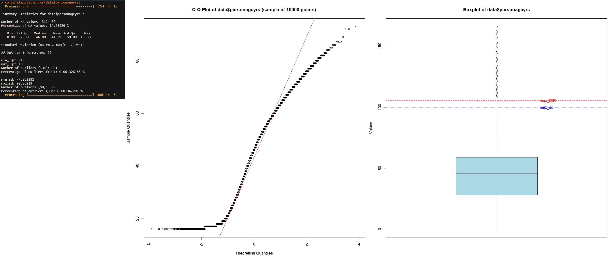

Calculate Statistics (_calcstats_)
================
A fast and streamlined R function for comprehensive statistical analysis of numeric and character data columns, with focus on normality assessment for large datasets.

- [Features](#Features)
- [Installation](#Installation)
- [Usage](#Usage)
- [Documentation](#Documentation)
- [Code](#Code)


## Features

- Automatic handling of both numeric and character data
- Comprehensive statistical summaries
- Normality assessment (skewness, kurtosis, Shapiro-Wilk, Kolmogorov-Smirnov tests)
- Outlier detection using IQR and standard deviation methods
- Visualization tools (QQ plots, boxplots, bar charts)
- Progress tracking and time measurement
- Option to save results and plots to files


## Installation

```r
# Install required packages if not already installed
install.packages(c("tidyverse", "data.table", "scales", "nortest", "e1071", "fastqq"))
```

<br>

Then source the function directly from GitHub:
```r
source("https://raw.githubusercontent.com/raymond-arthur/VRI-Github-stuff/main/calculate_statistics.R")
```

<br>
<br>

## Usage
### For numeric data
```r
calculate_statistics(your_data$numeric_column, save = TRUE, plots = TRUE)
```

### For character data
```r
calculate_statistics(your_data$character_column, save = FALSE, plots = TRUE)
```

<br>
<br>

### Parameters

    data_column: The column to analyze (numeric or character)
    
    save: Logical, whether to save results to files (default: FALSE)
    
    plots: Logical, whether to generate plots (default: TRUE)


### Output

For numeric data:

    Summary statistics (min, max, mean, quartiles)

    NA value analysis

    Normality tests (Shapiro-Wilk, Kolmogorov-Smirnov)

    Skewness and kurtosis measures

    Outlier detection (IQR and SD methods)

    QQ plot and boxplot visualization

For character data:

    Frequency table (top 200 categories)

    NA value analysis

    Bar chart visualization


## Documentation

Documentation for _calcstats_ can be found here:
<https://github.com/raymond-arthur/VRI-Github-stuff/> or with the R `?help` function

```r
?help calcstats
```

<br> <br>

## Code:


The entire codebase for this package can be found here:
<https://github.com/raymond-arthur/VRI-Github-stuff/blob/main/calculate_statistics.R>
<br> <br>


### Code aims and goals:

The goal of this function is to provide a self-contained, easily usable tool for comprehensive statistical analysis of data columns with special focus on:

    Normality Assessment:

        Visual examination via Q-Q plots

        Quantile and IQR analysis

        Outlier detection

        Formal statistical tests (for datasets ≤ 5000 observations)

    Big Data Support:

        Efficient processing of large datasets

        Sampling for computationally intensive tests

        Progress tracking

    Automated Reporting:

        Console output of key statistics

        Optional file output

        Visualization generation

### Example Output

<!-- -->


